# Système expert

## Introduction

Notre système expert est inspiré de l’exercice du médian sur le système d’ordre 0. L’objectif de notre programme est d’indiquer à l’utilisateur s'il peut fabriquer un objet à partir de ce qu’il possède dans son inventaire.

Minecraft est un jeu vidéo créé au début des années 2010. L’objectif du jeu est de survivre dans un environnement naturel à l’aide de différents outils et objets (haches, pioches, nourriture, armures…) qu’il doit fabriquer à partir de ce qu’il récolte.  Le jeu permet également au joueur de construire diverses structures à l’aide de blocs.

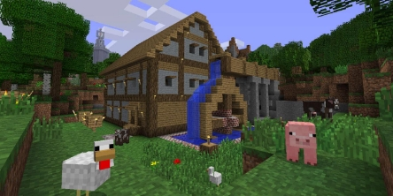

La fabrication d’un objet s’effectue dans l’inventaire. Pour fabriquer un objet, il suffit de le dessiner à l’aide de matières premières. Dans l’exemple suivant nous fabriquons 4 torches en mettant 1 charbon au-dessus de 1 bâton de bois.

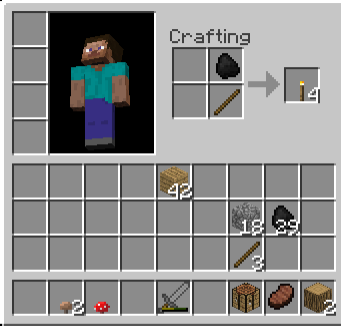

Il est à noter que les fabrications ne fabriquent pas toujours qu’un seul exemplaire de l’objet fabriqué. Enfin, les objets utilisés pour la fabrication sont consommés et disparaissent.

Cependant, l’inventaire ne possède qu’un artisanat de 2\*2 emplacements, ce qui est insuffisant pour fabriquer certains objets complexes, tels que des outils, qui nécessitent 3\*3 emplacements pour être dessinés. Le joueur doit alors utiliser une table (possédant un artisanat de 3\*3 emplacements) pour fabriquer ces objets.

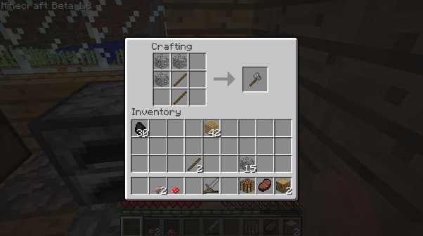

Le système expert que nous avons programmé permet donc de déterminer si nous sommes en capacité de fabriquer un objet à partir de notre inventaire, qui sera notre base de fait, en le confrontant à la liste des recettes disponibles, qui sera notre base de règles. Nous utilisons la version beta 1.8 du jeu, soit la dernière beta avant la sortie officielle du jeu en 2011.

Nous avons choisi ce sujet car Minecraft est un jeu que nous connaissons bien. De plus, le fait que certains objets nécessaires à la fabrication d’autres objets aient besoin d'être eux-même fabriqués apporte de la profondeur à notre système. Par exemple pour la fabrication d’une bibliothèque, nous devons d’abord fabriquer le papier, puis utiliser le papier pour fabriquer un livre, et enfin utiliser des livres pour fabriquer la bibliothèque. L’arbre de recherche de la fabrication de la bibliothèque a donc une profondeur de 4.

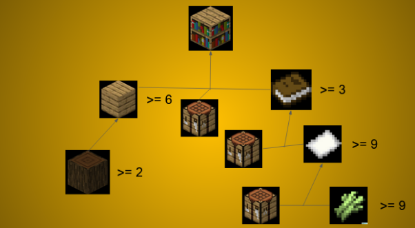

## Création du système expert

### Constitution de la base de règles:

La base de règles est constituée des 120 recettes présentes dans la version beta 1.8 du jeu. Pour constituer cette base, nous avons utilisé nos connaissances de joueurs et effectué des tests sur le mode créatif du jeu, nous permettant d’avoir accès à tous les objets du jeu en illimité. Ces tests nous permettaient de vérifier le bon fonctionnement des recettes, ainsi que le nombre d’exemplaires fabriqués à chaque fabrication. Nous avons également utilisé le site

<https://minecraft.fandom.com/fr/wiki/Objets> pour vérifier les recettes des objets. Cependant, étant donné que le jeu est mis à jour régulièrement, certaines recettes présentées sur le site ont changé depuis la version beta 1.8.

Nous avons choisis la version beta 1.8 du jeu pour limiter le nombre de règles à coder et pour simplifier certaines règles. En effet, à partir de la sortie officielle du jeu, différents types de bois ont été rajoutés (bois de hêtres, bois de chênes, bois de sapin…) qui sont considérés comme des objets différents pour certaines recettes (notamment les recettes d'escaliers), et considéré comme le même objet pour d’autres, ce qui rendait la base de règles plus complexe.

Chaque règle est composée de la même manière :

 - l’objet fabriqué par la recette
 - la quantité fabriquée par cette recette
 - la liste des objets nécessaires à la fabrication avec leur quantité
 - Si l'objet nécessite une table pour être fabriqué, nous rajoutons l’argument “crafting\_table”, sinon nous ne rajoutons rien. Il faut cependant considérer que la nécessité d’une table ne dépend pas du nombre d’objets nécessaires à la fabrication. Certains objets ne consomme que 3 composants pour être fabriqués mais nécessitent quand même une table

### Mise en place du moteur d’inférence

Le moteur d’inférence choisi est en chaînage arrière: nous partons de l’objet que nous voulons fabriquer pour arriver aux objets que nous avons dans notre base de fait. Nous effectuons également un parcours en profondeur.

*Explication de la fonction recherche :*

Tout d’abord on affecte à regle la règle de recette associée à l’objet demandé. Ensuite on affecte à quantité le nombre à fabriquer et à item l’item à fabriquer.

Ensuite s’ensuit un cond pour vérifier plusieurs conditions :

- on vérifie d’abord si l’item est fabricable en vérifiant si une règle correspondante est dans la base de règles.

  Ensuite on vérifie si l’item est dans l’inventaire. S’il n’y est pas on renvoie simplement erreur explicitant le nombre d’exemplaires manquants.

  Si l’item est bien présent dans l’inventaire on vérifie s’il est présent en quantité suffisante. si ce n’est pas le cas on renvoie un message d’erreur explicitant le nombre d’exemplaires manquants.

- la deuxième condition permet de vérifier si l’objet a besoin d’une table et si l’utilisateur en possède une. Si elle est nécessaire mais que l’utilisateur n’en a pas alors on renvoie un message d’erreur expliquant qu’il n’y a pas de table.

La dernière condition consiste à la fabrication de l’objet. Nous allons détailler chacune des étapes.

Tout d’abord on ajoute en quantité nulle tous les items nécessaires pour la fabrication. (Cela permet d’assurer dans l’inventaire la présence de chaque item nécessaire, même s’il est en quantité nulle). Par exemple, si je n’ai pas de bâtons mais que j’en ai besoin il y aura (stick 0) dans l’inventaire, ce qui ne change pas le fait que j’ai toujours 0 bâton mais maintenant l’item stick apparaît dans l’inventaire. Cet ajout permet de résoudre des erreurs de types lors de comparaisons et d'éviter que le programme ne compare des valeurs entières à Nil, ce qui crée des erreurs.

Ensuite on  parcourt chaque prémisse à l’aide d’un dolist. on commence par vérifier si dans l’inventaire nous avons bien l’item nécessaire en assez grande quantité.

Si c’est le cas alors on retire le nombre d’item utilisés lors de la fabrication.

Sinon on cherche à obtenir ce qui nous manque. 2 cas sont possibles :

Soit l’item manquant est craftable (fabricable). Ainsi dans ce cas le but devient l’item manquant à fabriquer. En ce qui concerne la quantité à fabriquer, on soustrait le total nécessaire à ce qui est déjà présent dans l’inventaire. On cherche donc à obtenir ce qui manque. Par exemple, une épée en pierre demande 2 stick. Si j’en ai 1 il m’en manque donc 1. Ainsi on modifie la quantité à crafter de sorte qu’elle coïncide avec le nombre d’item obtenu après la fabrication. Comme une fabrication de stick en donne 4 on va donc en fabriquer 4 et non plus 1.

Si l’item manquant n’est pas craftable alors la quantité nécessaire reste le nombre d’item à avoir pour la fabrication. Par exemple pour 1 wool il faut 4 \_string. Si dans mon inventaire j’en ai que 2 ce n’est pas assez. Ainsi lors du rappel de la fonction il y aura le bon message d’erreur en en demandant 4 (affichage qu’il en manque 2).

On rappelle ensuite la fonction recherche avec en dernier paramètre ce qui sera utilisé pour la fabrication précédente. Par exemple pour la fabrication de stick pour une wooden\_sword le programme pourra se rappeler qu’il faut en retirer 2 pour la fabrication de la wooden\_sword.

Finalement une dernière vérification s’impose. Si l’item est celui que l’on veut fabriquer au tout début alors on ajoute tout simplement la quantité fabriquée. Sinon on ajoute ce qui a été fabriqué - ce qui est utilisé pour les fabrications précédentes.

La fonction marche de manière récursive grâce à recherche\_rec. Une fois l’inventaire entré on peut enchaîner autant de crafts que l’on veut et s’ils sont possibles. L’inventaire sera modifié en conséquence.

## Tests du système
### Essais

Nous allons tester notre algorithme pour fabriquer une bibliothèque (bookshelf). Nous avons au départ 2 bûches (wood), 9 cannes à sucre (sugar\_canes) et une table (crafting\_table).

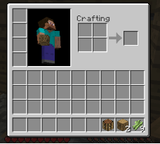

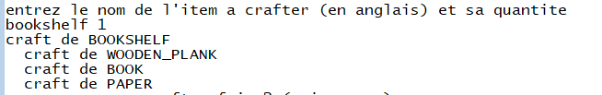

Nous demandons alors au programme de fabriquer une bibliothèque. Nous voyons que le programme trouve une solution pour fabriquer la bibliothèque.

Le programme nous donne également les fabrications intermédiaires nécessaires à la fabrication de l’objet. Tout d’abord nous devons fabriquer du papier

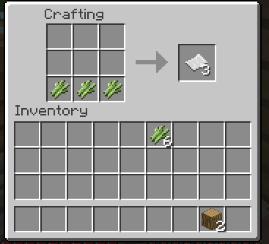

puis avec le papier nous devons fabriquer des livres

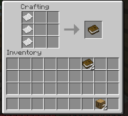

puis nous devons transformer les bûches en planche

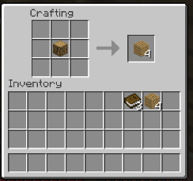

nous pouvons alors fabriquer la bibliothèque

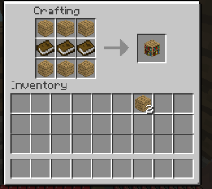

A la fin de la fabrication, nous obtenons effectivement le même inventaire dans le jeu et dans lisp.

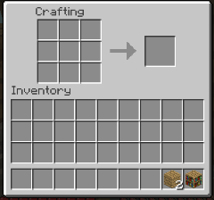

Nous sommes en train d’utiliser la table, c’est pourquoi elle n'apparaît pas dans l’inventaire. Nous allons maintenant tenter de fabriquer un lit

Nous avons dans notre inventaire 1 bûche (wood) et 2 blocs de laine (wool), en plus de notre table

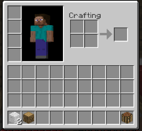

Dans lisp

Nous demandons au programme de fabriquer le lit

Un lit nécessite 3 blocs de laine et 3 planches pour être fabriqué, il nous manque donc 1 bloc de laine. Le programme nous renvoie donc un message d’erreur.

Cependant, au lieu de nous signaler qu’il manque un bloc de laine, le programme nous renvoie qu’il manque 4 ficelles (\_string) pour fabriquer le bloc de laine manquant.

Nous observons donc que le programme fonctionne de la manière désirée, nous pouvons cependant noter quelques pistes d’amélioration pour le programme.

pistes d’améliorations:

Au cours de notre projet, nous avons établi plusieurs pistes pour améliorer notre programme.

Tout d’abord, pour revenir à notre exemple du lit, dans le cas où nous manquons de laine, le programme nous invite à chercher des ficelles pour fabriquer la laine. En effet, la plupart du temps il est nécessaire de trouver les matières premières de certains objets pour les obtenir. Cependant pour le cas de la laine, il est dans les faits plus simple d’obtenir un bloc de laine (il suffit pour cela de tuer ou tondre un mouton, qui apparaissent régulièrement dans la nature) que d’obtenir 4 ficelles (il faut tuer 4 araignées, qui n’apparaissent que la nuit ou en souterrain, et qui attaquent le joueur). Une des améliorations possibles du programme pourrait alors être de déterminer le moyen le plus simple d’obtenir les objets. Nous pourrions par exemple ajouter à la base de règle une variable d'intérêt, qui permettrait de dire si la recette est intéressante ou non, et selon l'intérêt de la recette indiquer des conseils différents au joueur. Nous pourrions également donner l’ensemble des solutions possibles pour trouver l’objet manquant.

De plus, certains objets du jeu peuvent être fabriqués en étant cuits au four (les métaux par exemple). Nous pourrions donc intégrer à notre système expert la cuisson d'objets. Dans un premier temps nous pouvons regarder si nous avons un four, puis regarder si nous avons assez de combustible pour faire cuire les objets nécessaires. Cependant cette amélioration nécessiterait une deuxième base de règles contenant les durées de combustion des différents objets, pour voir si nous avons suffisamment de combustibles pour faire cuire nos objets.

## Conclusion

Lors de ce TP nous avons repris le système expert proposé lors de l’examen médian pour le porter à l’ordre 1 et ainsi le rendre utilisable en jeu. Ce projet nous a donc permis de développer des compétences en lisp et en algorithmique, et nous a permis d’en apprendre plus sur le fonctionnement d’un système expert. Le passage à l’ordre 1 nous a posé quelques difficultés, mais nous avons tout de même réussi à mener ce projet à bout grâce à une bonne gestion du temps.

Nous avons également pu réfléchir à plusieurs pistes d’améliorations de notre programme pour le rendre plus efficace. En effet, notre algorithme ne permet que de traiter des fabrications effectuées par l’artisanat, nous pourrions donc créer une fonctionnalité permettant de prendre en compte le cuissons des objets au four. Enfin, pour adapter notre algorithme aux nouvelles versions de minecraft, plusieurs fonctionnalités pourraient être ajoutées, telle que la mise en place d’une aide permettant de donner la solution la plus efficace pour obtenir un objet dans le cas où il existe plusieurs manières de faire.

